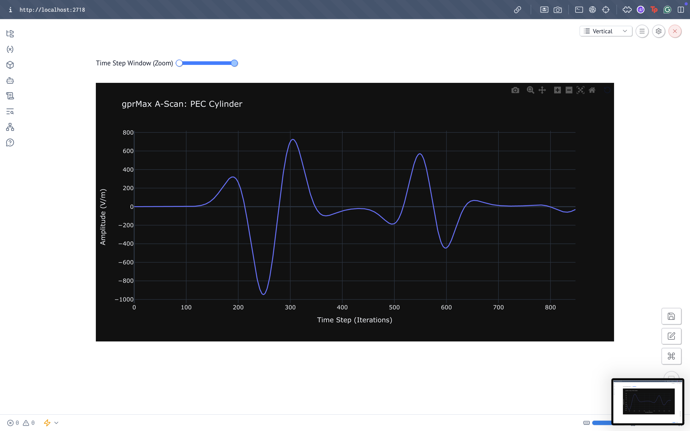
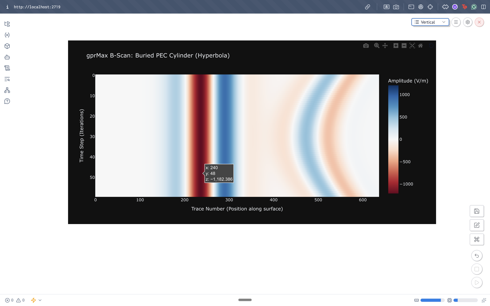
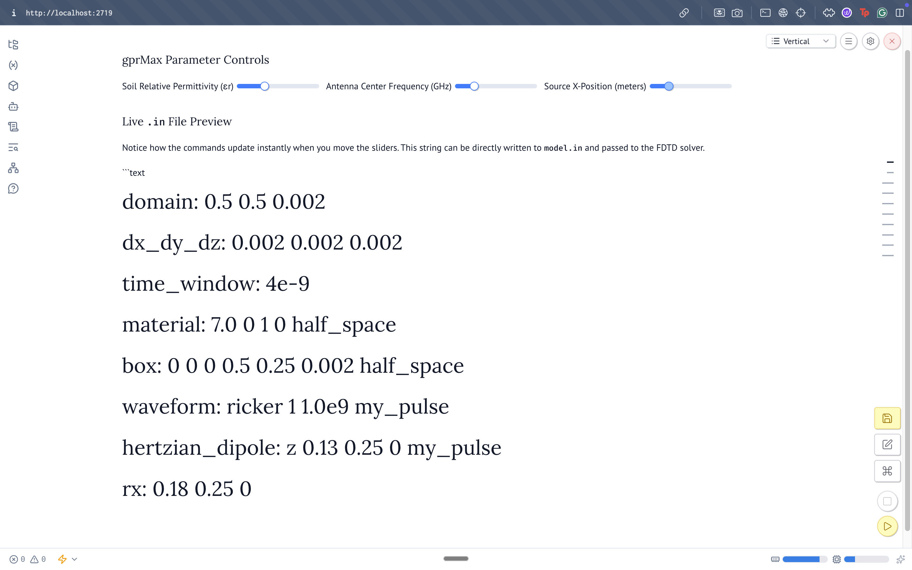

# gprMax Marimo Dashboard Prototype

A working prototype built for GSoC 2026 Project 2. All three components run against the `devel` branch on Apple Silicon (M1), Python 3.11.

## Components

**`ascan_dashboard.py`** reads a gprMax HDF5 output file and plots the Ez field at a receiver. A range slider lets you zoom into any time-step window, and the chart updates instantly.

```bash
marimo run ascan_dashboard.py
```



**`bscan_dashboard.py`** reads a merged multi-trace HDF5 file and renders the radargram as an interactive Plotly heatmap. You can hover over any pixel to get the exact amplitude, timestep, and trace number.

```bash
marimo run bscan_dashboard.py
```



**`parameter_controls.py`** has three sliders (soil permittivity, antenna frequency, source position) that reactively update a live `.in` file preview. The output is valid gprMax syntax ready to be written to disk.

```bash
marimo run parameter_controls.py
```



## Setup

```bash
conda create -n gprmax-marimo python=3.11
conda activate gprmax-marimo

# gprMax devel branch
git clone -b devel https://github.com/gprMax/gprMax.git
cd gprMax
pip install -e .

# dashboard dependencies
pip install marimo h5py plotly numpy
```

**Note on Apple Silicon (M-Series):** The build requires two fixes. First, a legacy Python 2 exception syntax in `setup.py` needs updating. Second, OpenMP requires Homebrew's `libomp`:

```bash
brew install libomp
```

Then configure `setup.py` to use `-Xpreprocessor -fopenmp` with the Homebrew include and library paths.

## Generating test data

The `devel` branch doesn't currently include the default example `.in` files in `user_models/`, so I used the files in `examples/` and wrote my own. For a B-scan, run gprMax with `-n` traces and then merge using the v4 toolbox:

```bash
python -m gprMax my_bscan.in -n 60
python toolboxes/Utilities/outputfiles_merge.py my_bscan
```

## Why marimo over Jupyter?

In short: hidden state. In Jupyter, if you change a parameter slider, you have to manually re-run every downstream cell. In marimo, dependent cells update automatically. For a simulation dashboard, that's not a minor convenience - it's the whole point.

gprMax currently has `tools/plot_Ascan.py` and `tools/plot_Bscan.py` as static terminal scripts. This prototype demonstrates what an integrated, reactive replacement looks like.

---

**Gaurav Sharma** — GSoC 2026 applicant, Project 2. GitHub: [@alphaleporus](https://github.com/alphaleporus)